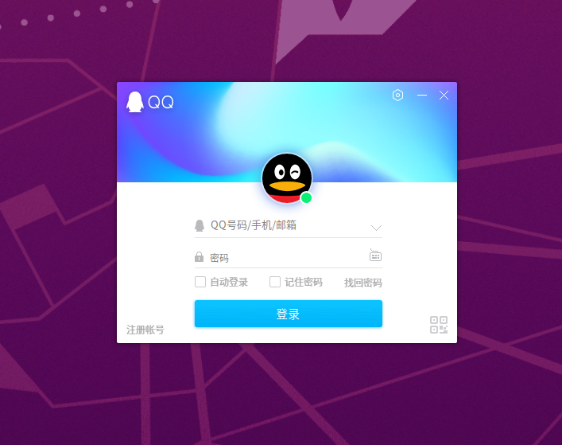

## 前言
用过Ubuntu的都知道对于日常聊天~~（划水）~~有多不友好吧，QQ官方的linux版本就只有个90年代的聊天功能，最起码的斗图乐趣都没了，用户体验极差！微信只能用网页版，果断不能忍。后来总算找到了能用windows版本的方法，还能通过docker启动，对系统环境没有任何影响，鱼与熊掌我都要，哈哈哈！

## 安装docker环境
官方一键安装方法（知道你们懒，直接给你们贴出来了）：
```
curl -fsSL https://get.docker.com | bash -s docker --mirror Aliyun
```
如果上面的命令执行提示没有`curl`命令的话，可以安装一下http环境：
```
sudo apt-get install \
    apt-transport-https \
    ca-certificates \
    curl \
    gnupg-agent \
    software-properties-common
```
如果没有接触过docker的话，可去看以前的文章学习基本操作方法：[被忽略的后端开发神器--docker](../../backend/201812/20181226-docker.md)

## 拉取QQ、微信镜像
GitHub地址：
微信：[https://github.com/bestwu/docker-wechat](https://github.com/bestwu/docker-wechat)
QQ：[https://github.com/bestwu/docker-qq](https://github.com/bestwu/docker-qq)
>实在遇到解决不了的问题就去开发者那边搞事情吧，我只是大自然的搬运工~~~

### 配置环境
允许所有用户访问X11服务,终端运行命令:
```
xhost +
```

### 拉取生成QQ容器

#### 1、docker-compose方式
```yaml
version: '2'
services:
  qq:
    image: bestwu/qq:office
    container_name: qq
    ipc: host
    devices:
      - /dev/snd #声音
    volumes:
      - /tmp/.X11-unix:/tmp/.X11-unix
      - /home/peter/TencentFiles:/TencentFiles #使用自己的用户路径
    environment:
      - DISPLAY=unix$DISPLAY
      - XMODIFIERS=@im=fcitx # 中文输入，这里根据系统输入法类型自行输入，默认是IBus
      - QT_IM_MODULE=fcitx
      - GTK_IM_MODULE=fcitx
      - AUDIO_GID=63 # 可选 默认63（fedora） 主机audio gid 解决声音设备访问权限问题
      - GID=$GID # 可选 默认1000 主机当前用户 gid 解决挂载目录访问权限问题
      - UID=$UID # 可选 默认1000 主机当前用户 uid 解决挂载目录访问权限问题
```
#### 2、docker run方式
```
docker run -d --name qq \
    --device /dev/snd --ipc="host"\
    -v $HOME/TencentFiles:/TencentFiles \
	-v /tmp/.X11-unix:/tmp/.X11-unix \
    -e XMODIFIERS=@im=fcitx \
    -e QT_IM_MODULE=fcitx \
    -e GTK_IM_MODULE=fcitx \
    -e DISPLAY=unix$DISPLAY \
    -e AUDIO_GID=`getent group audio | cut -d: -f3` \
    -e VIDEO_GID=`getent group video | cut -d: -f3` \
    -e GID=`id -g` \
    -e UID=`id -u` \
    bestwu/qq:im
```


### 拉取生成微信容器

#### 1、docker-compose方式
```yaml
version: '2'
services:
  wechat:
    image: bestwu/wechat
    container_name: wechat
    ipc: host
    devices:
      - /dev/snd
    volumes:
      - /tmp/.X11-unix:/tmp/.X11-unix
      - /home/peter/WeChatFiles:/WeChatFiles #使用自己用户目录
    environment:
      - DISPLAY=unix$DISPLAY
      - QT_IM_MODULE=fcitx # 中文输入，这里根据系统输入法类型自行输入，默认是IBus
      - XMODIFIERS=@im=fcitx
      - GTK_IM_MODULE=fcitx
      - AUDIO_GID=63 # 可选 默认63（fedora） 主机audio gid 解决声音设备访问权限问题
      - GID=1000 # 可选 默认1000 主机当前用户 gid 解决挂载目录访问权限问题
      - UID=1000 # 可选 默认1000 主机当前用户 uid 解决挂载目录访问权限问题
```

#### 2、docker run方式
```
docker run -d --name wechat --device /dev/snd --ipc="host"\
    -v /tmp/.X11-unix:/tmp/.X11-unix \
    -v $HOME/WeChatFiles:/WeChatFiles \
    -e DISPLAY=unix$DISPLAY \
    -e XMODIFIERS=@im=fcitx \
    -e QT_IM_MODULE=fcitx \
    -e GTK_IM_MODULE=fcitx \
    -e AUDIO_GID=`getent group audio | cut -d: -f3` \
    -e GID=`id -g` \
    -e UID=`id -u` \
    bestwu/wechat
```


### 微信更新到3.2.1
因为微信3.3.0以上已不支持xp系统环境了，所以这个deep-wine只能更新到3.2.1。
```
docker exec -it wechat bash
mkdir /tmp/wechat
cd /tmp/wechat
wget https://dldir1.qq.com/weixin/Windows/WeChat_for_XP_SP3_To_Vista.exe
su wechat
env WINEPREFIX=/home/wechat/.deepinwine/Deepin-WeChat deepin-wine WeChat_for_XP_SP3_To_Vista.exe
```

#### 常用命令

通过上面其中一种方式生成后，以后就可以通过容器名来操作docker相应的容器了：
```
# 启动
docker start qq(wechat)

# 停止
docker stop qq(wechat)

# 重启
docker restart qq(wechat)
```

## 结语

不是工作必须要用到Ubuntu，谁又会这么折腾呢，划水还是得且划且珍惜。

