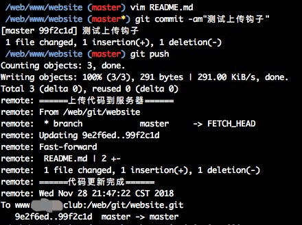

---
categories: 
- 运维
tags:
- git
- 服务器
date:
- 2018-11-29
---  
  
# 手摸手带你部署git服务器实现自动发布代码
  
前段趁着活动买了个腾讯云服务器，一直没抽时间去折腾，最近才开始部署了一个自己专属的git仓库，实现代码自动发布部署功能。（我也想成为努力向上，积极进取的有志青年啊！）文章的内容基本都是参考自谷歌搜索，然后按我的思路重新整理一遍，既是为了分享也是为了巩固知识。
我也是第一次折腾服务器，前期部署就不写太详细了，装个git是必须的吧？（滑稽笑）
  
## 创建git用户
  
```
# 创建git用户
adduser git
```
添加git权限成员
```
# 创建/home/git/.ssh/authorized_keys 文件（通过这种方式能使拥有公钥的成员直接访问仓库）
mkdir /home/git
mkdir .ssh
touch authorized_keys
# 使用vim命令将公钥添加到authorized_keys文件里面
```
生成公钥的方法可查看 [git官方文档](https://git-scm.com/book/zh/v2/%E6%9C%8D%E5%8A%A1%E5%99%A8%E4%B8%8A%E7%9A%84-Git-%E7%94%9F%E6%88%90-SSH-%E5%85%AC%E9%92%A5 )
  
## 初始化仓库
  
创建一个存放git仓库的文件夹
```
mkdir /web/git
cd /web/git
```
初始化仓库
```
git init --bare website.git
# 注意 这里有个坑 因为我们初始化的时候是处于root管理员状态，所以需要将这个仓库的文件权限设置为刚才创建的git用户
# 否则的话后面push将没有权限
chown -R git website.git
```
> git init正常初始化仓库会显示项目文件结构，里面存在.git文件夹。而这里添加--bare参数生成裸仓库，里面的项目文件结构隐藏，将正常方式初始化的.git里面文件结构暴露出来。
  
生成项目仓库
```
mkdir /web/www
cd /web/www
# 将刚才初始化的裸仓库克隆到项目文件夹
git clone /web/git/website.git
# 在这里，还是别忘了要给项目文件夹加上git用户操作权限
chown -R git website
```
到这一步的时候代码仓库已经基本初始化完成了，接下来试试将仓库从线上克隆下来。
## 克隆仓库到本地
  
```
# 通过ip地址从配置好的线上仓库拉取下来
git clone git@118.24.217.XXX:/web/git/website.git
# 如果有配置域名的话也可以通过域名拉取
git clone git@www.XXX.XXX:/web/git/website.git
```
刚开始的时候因为已经添加了本地的密钥到线上git服务器，所以这一步是不需要密码的，直接能克隆下来。
## 创建文件并上传
  
```
# 打开刚才克隆下来的本地仓库
cd website
# 创建README.md文件
touch README.md
git add .
git commit -am"创建README.md文件"
git push
```
啧啧 完美 到这一步的时候就上传成功了！
接下来就开始重头戏，我们需要设置git的post-receive钩子，在push成功的时候运行我们设置的一系列命令，进而达到自动编译更新线上代码。
## 添加post-receive钩子
  
回到线上服务器，我们打开/web/git/website.git/hooks文件夹。
```
# 生成post-receive文件
touch post-receive
# 使用vim编辑
vim post-receive
```
在post-receive文件输入我们的命令行命令
```
#!/bin/sh
  
# 打印输出
echo '======上传代码到服务器======'
# 打开线上项目文件夹
cd /web/www/gd168
# 这个很重要，如果不取消的话将不能在cd的路径上进行git操作
unset GIT_DIR
git pull origin master
# 自动编译vue项目
# npm run build
echo $(date) >> hook.log
echo '======代码更新完成======'
```
保存后给post-receive文件加上运行权限
```
chmod +x post-receive
```
搞定，现在试着修改下README.md文件，然后发布上去就能看到部署效果了。没毛病，妥妥的！

## 结语
  
因为是第一次写文章，怕大家看不明白，码文章的过程中还一步步重新走了遍流程，大概……应该……是写得很详细了吧。这些都是我遇到的坑，如果还有啥不妥的地方希望大家能够谅解，有什么不对或不够好的地方希望能联系我修改下，最怕耽误了你们宝贵的青春。带歪车就不好了，新手上路，嘿嘿。
  