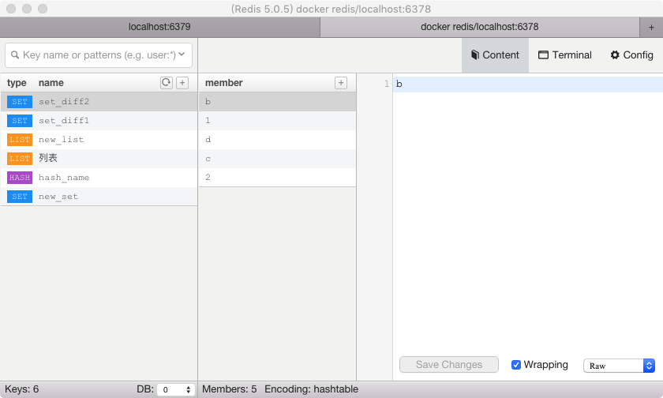
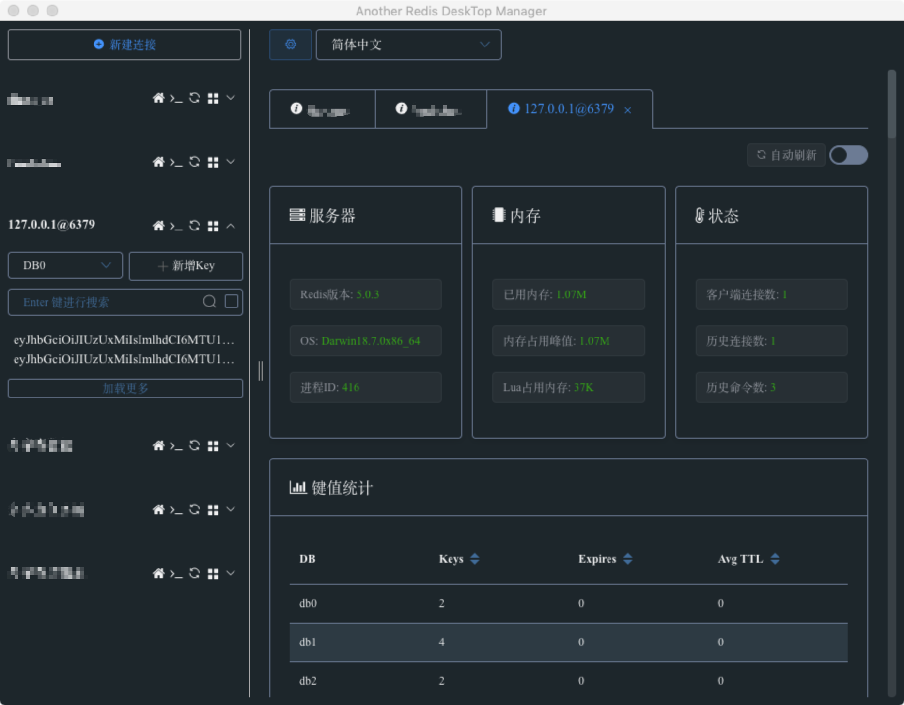
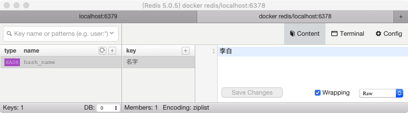

## 通过docker启动redis
在尝试操作`redis`之前，首先我们要先启动一个`redis`服务器，我们可以通过docker来起个测试服务器，编排`docker-compose.yml`:
```
version: '3'
services:
  redis_container:
    image: redis
    command: redis-server --requirepass yourpassword # 配置 Redis 密码
    ports:
      - "6379:6379" # 映射端口
    volumes:
      - /web/docker/db/mongo:/data  # 映射数据存储文件位置
```
然后通过`docker-compose up -d`启动。

## 连接
普通链接：
```
import redis

r = redis.StrictRedis(host='127.0.0.1', port=6379, password='yourpassword', db=0, decode_responses=True) # 默认数据库为0
```
如果需要对一个`redis`服务器进行多个连接的话，可以通过`ConnectionPool`方法来建立一个连接池，避免每次建立、释放连接带来的额外开销。
连接池：
```
pool = redis.ConnectionPool(host='127.0.0.1',port=6379, password='yourpassword', db=0, decode_responses=True)

r = redis.Redis(connection_pool=pool)
```

### 可视化工具 Medis

~~讲真，用`Medis`来看数据真挺爽的，不用在命令行里面敲，切换数据库查看贼方便。这个还是开源项目来的，强烈推荐使用。~~ 已经开始收费了，所以放弃使用。


现在推荐使用[Another Redis Desktop Manager](https://github.com/qishibo/AnotherRedisDesktopManager)，免费开源，功能更多，UI界面更好看


## Redis数据类型
`Redis`支持五种数据类型：`string`（字符串），`hash`（哈希），`list`（列表），`set`（集合）及`zset`(sorted set：有序集合)。

## String（字符串）操作
`string`是`redis`最基本的类型，一个`key`对应一个`value`。`string`类型是二进制存储的，所以可以任何数据，比如图片数据或序列化的对象。`string`类型是最基本的数据类型，最大能存储512MB。

### 1.set 设置值
```
r.set('name', 'Mrli2016')
'''参数：
    set(name, value, ex=None, px=None, nx=False, xx=False)
    ex，过期时间（秒）
    px，过期时间（毫秒）
    nx，如果设置为True，则只有name不存在时，当前set操作才执行,同setnx(name, value)
    xx，如果设置为True，则只有name存在时，当前set操作才执行
'''
```

### 2.get 获取值
```
print(r.get('name'))
# malin
```

### 3.mset 批量设置值
```
# 批量设置值
r.mset({'name1':'李白', 'name2':'李逵'})
```

### 4.mget 批量获取值
`mget(keys, *args)`一次性取出对应键的值。
```
r.mget('name1', 'name2')
# ['李白', '李逵']
```

### 5.getset 获取旧值，设置新值
```
print(r.getset('name1', '李元芳'))
# 李白
print(r.get('name1'))
# 李元芳
```

### 6.getrange 根据字节获取子序列
`getrange(key, start, end)`，通过键获取到值，然后按起始位置跟结束位置截取值。
```
# 一个汉字3个字节 1个字母一个字节
r.set('name', 'i am 李子')

print(r.getrange('name', 0, 2))
# i a
print(r.getrange('name', 0, 7))
# i am 李
```

### 7.setrange 修改字符串内容
`setrange(name, offset, value)`，修改字符串内容，从指定字符串索引开始向后替换，如果新值太长时，则向后添加。
```
r.set('name', 'mrli2016')
r.setrange('name', 4, 'zi')

print(r.get('name'))
# mrlizi16

r.setrange('name', 6, ' start in 2016')

print(r.get('name'))
# mrlizi start in 2016
```

### 8.strlen 返回值的字节长度
一个汉字 = 3个字节
```
r.set('name', 'mr李子')

print(r.strlen('name'))
# 8
```

### 9.incr 值的自增
`incr(self, name, amount=1)`，自增对应键的值，当该键名不存在时，则`key=amount`，每次自增加的值为`amount`，默认为1。
```
r.incr('num')
print(r.get('num'))
# 1
print(r.incr('num', amount=2))
# 3
print(r.incr('num', amount=3))
# 6
print(r.incr('num'))
# 7
```

### 10.append 在键对应的值后面添加内容
`append(name, value)`
```
r.set('name', '子非鱼')
r.append('name', ' is mrli2016')

print(r.get('name'))
# 子非鱼 is mrli2016
```

## Hash 操作

`Redis hash`是一个键值`(key=>value)`对集合。`Redis hash`是一个`string`类型的`field`和`value`的映射表，`hash`特别适合用于存储对象。

### 1.hset name对应的hash中设置一个键值对
`hset(name, key, value)`，设置时如果不存在则创建，存在则修改。
```
r.hset('hash_name', '名字', '李白')
```
存储结果：


### 2.hget 在name对应的hash中根据key获取value
```
print(r.hget('hash_name', '名字'))
# 李白
```

### 3.hgetall 获取name对应hash的所有键值
`hgetall(name)`
```
r.hset('hash_name', '性别', '男')

print(r.hgetall("hash_name"))
# {'名字': '李白', '性别': '男'}
```

### 4.hmset 在name对应的hash中批量设置键值对
`hmset(name, mapping)`，`mapping`:字典
```
author={"名字": "mrli2016", "性别": "男"}
r.hmset("author", author)

print(r.hget("author", "名字"))
# mrli2016
```

### 5.hmget 在name对应的hash中获取多个key的值
`hmget(name, keys, *args)`
```
print(r.hmget("author", ['名字', '性别']))
# ['mrli2016', '男']
print(r.hmget("author", "名字", "性别"))
# ['mrli2016', '男']
```

### 6.hlen 获取hash中键值对的个数
```
print(r.hlen("author"))
# 2
```

### 7.hkeys 获取所有的key
```
print(r.hkeys("author"))
# ['名字', '性别']
```

### 8.hvals 获取所有的值
```
print(r.hvals("author"))
# ['mrli2016', '男']
```

### 9.hexists 检查key是否存在
```
print(r.hexists("author", "名字"))
# True
print(r.hexists("author", "职业"))
# False
```

### 10.hdel 删除键值对
`hdel(name,*keys) `，删除指定name对应的key所在的键值对
```
print(r.hgetall("author"))
# {'名字': 'mrli2016', '性别': '男'}

r.hdel("author", "性别")

print(r.hgetall("author"))
# {'名字': 'mrli2016'}
```

## List 操作
`Redis`列表是简单的字符串列表，按照插入顺序排序。你可以添加一个元素到列表的头部（左边）或者尾部（右边）。

### 1.lpush 在name对应list的左边添加元素
`lpush(name,values)`
```
r.lpush("list_name", 'mrli2016')
r.lpush("list_name", 1, 2, 3)

print(r.lrange('list_name', 0, -1))
# ['3', '2', '1', 'mrli2016']
```

### 2.rpush 在name对应list的右边边添加元素
`rpush(name,values)`
```
r.rpush("list_name", 'start')

print(r.lrange('list_name', 0, -1))
# ['3', '2', '1', 'mrli2016', 'start']
```

### 3.lpushx 仅在对应的list存在时在左边添加
`lpushx(name,value)`

### 4.rpushx 仅在对应的list存在时在右边添加
`rpushx(name,value)`

### 5.llen 返回list的长度
```
print(r.llen("list_name"))
# 5
```

### 6.lset 对list中的某一个索引位置重新赋值
```
r.lset("list_name", 3, "mrlizi")

print(r.lrange('list_name', 0, -1))
# ['3', '2', '1', 'mrlizi', 'start']
```

### 7.lrem 删除name对应的list中的指定值
`lrem(name, count=0, value)`
```
r.lrem("list_name", 2, 'mrlizi')
''' 
    参数：
    name:  redis的name
    count: count=0 删除列表中所有的指定值；
           count=2 从左往右开始找，删除2个指定的值；
           count=-2 从右往左开始找，删除2个指定的值
    value: 要删除的值
'''

print(r.lrange('list_name', 0, -1))
# ['3', '2', '1', 'start']
```

### 8.lpop 移除列表的左侧第一个元素，并返回被移除的元素
```
print(r.lpop("list_name"))
# 3
```

### 9.lindex 根据索引获取列表内元素
`lindex(name, index)`
```
print(r.lindex("list_name", 2))
# start
```

### 10.lrange 分片获取元素
`lrange(name, start, end)`
```
print(r.lrange('list_name', 0, -1))
# ['2', '1', 'start']
```

### 11.ltrim 删除范围外的值（裁剪）
`ltrim(name, start, end)`
```
r.ltrim("list_name", 0, 1)

print(r.lrange('list_name', 0, -1))
# ['2', '1']
```

### 12.rpoplpush 将一个列表最右边的取出添加到另一个列表的左边
`rpoplpush(src, dst)`
```
r.rpoplpush('list_name', 'new_list')
print(r.lrange('list_name', 0, -1))
# ['2']
print(r.lrange('new_list', 0, -1))
# ['1']
```

## Set 操作
`Redis`的`Set`是`string`类型的无序集合。集合是通过哈希表实现的，所以添加，删除，查找的复杂度都是O(1)。

### 1.sadd(name,values) 集合中添加元素
```
r.sadd("set_name", 1, '2', 3, '3', 3, 'a', 'b')
```

### 2.smembers(name) 查询集合所有元素
```
print(r.smembers('set_name'))
# {'2', 'a', '1', 'b', '3'}
```

### 3.scard(name) 获取集合中的元素个数
```
r.scard("set_name")
# 5
```

### 4.sdiff(keys, *args) 在第一个集合且不在其他集合的元素集合
```
r.sadd('set_diff1', '1', 'a', 'b', 'c')
r.sadd('set_diff2', '2', 'b', 'c', 'd')

print(r.sdiff('set_name', 'set_diff1', 'set_diff2'))
# {'3'}
```

### 5.sinter(keys, *args) 获取多个集合的并集
```
print(r.sinter('set_name', 'set_diff1', 'set_diff2'))
# {'b'}
```

### 6.sismember 检查元素是否存在集合内
```
print(r.sismember('set_name', '1'))
# True
print(r.sismember('set_name', 'f'))
# False
```

### 7.smove(src, dst, value) 将某个元素从一个集合中移动到另外一个集合
```
r.smove('set_diff1', 'set_diff2', '1')

print(r.smembers('set_diff1'))
# {'c', 'a', 'b'}
print(r.smembers('set_diff2'))
# {'2', 'd', 'b', 'c', '1'}
```

### 8.spop(name) 从集合移除一个成员，并将其返回
因集合是无序的，所以是随机移除
```
print(r.spop('set_name', '1'))
# ['b']
print(r.smembers('set_name'))
# {'1', '3', '2', 'a'}
```

### 9.srandmember(name, numbers) 从集合中随机获取numbers个元素
```
print(r.srandmember("set_name",2))
# ['1', '2']
```

### 10.srem(name, *values) 删除集合中的某些值
```
r.srem("set_name","2","3")
print(r.smembers('set_name'))
# {'1', 'a'}
```

### 11.sunion(keys, *args) 获取多个name对应的集合的并集
```
print(r.sunion("set_name", "set_diff1", "set_diff2"))
# {'2', 'a', 'd', 'c', '1', 'b'}
```

### 12.sunionstore(dest,keys, *args) 获取多个name对应的集合的并集，并将结果保存到dest对应的集合中
```
r.sunionstore('new_set', "set_name", "set_diff1", "set_diff2")
print(r.smembers('new_set'))
# {'d', '2', '1', 'a', 'c', 'b'}
```

## 有序集合 zset
`zset`和`set`一样也是`string`类型元素的集合,且不允许重复的成员。
不同的是每个元素都会关联一个`double`类型的分数。`redis`正是通过分数来为集合中的成员进行从小到大的排序。

`zset`的成员是唯一的,但分数(score)却可以重复。

### 1.zadd(name, *args, **kwargs) 添加元素
```
r.zadd("zset_name", {"a1": 6, "a2": 2, "a3": 5})
```

### 2.zrange 按索引范围获取集合元素
`zrange( name, start, end, desc=False, withscores=False, score_cast_func=float)`
```
print(r.zrange("zset_name", 0, -1, desc=False, withscores=True, score_cast_func=int))
# [('a2', 2), ('a3', 5), ('a1', 6)]
'''
  参数：
    name    集合的name
    start   有序集合索引起始位置
    end     有序集合索引结束位置
    desc    排序规则，默认按照分数从小到大排序
    withscores  是否获取元素的分数，默认只获取元素的值
    score_cast_func 对分数进行数据转换的函数
'''
```

### 3.zcard(name) 获取集合元素的数量
```
print(r.zcard('zset_name'))
# 3
```

### 4.zcount(name, min, max) 获取有序集合中分数在[min,max]之间的个数
```
print(r.zcount('zset_name', 5, 6))
# 2
```

### 5.zincrby(name, amount, value) 自增有序集合内value对应的分数
```
#自增有序集合内value对应的分数
r.zincrby("zset_name", 2, "a1")#自增zset_name对应的有序集合里a1对应的分数
```

### 6.zscore(name, value) 获取name对应有序集合中 value 对应的分数
```
print(r.zscore("zset_name","a1"))
# 8.0
```

### 7.zrank(name, value)、zrevrank(name, value) 获取在集合中的排名
```
print(r.zrange("zset_name", 0, -1, withscores=True))
# [('a2', 2.0), ('a3', 5.0), ('a1', 8.0)]

print(r.zrank("zset_name", "a2")) #从小到大排序
# 0

print(r.zrevrank("zset_name", "a2")) #从大到小排序
# 2
```

### 8.zrem(name, values) 删除有序集合中的元素
```
r.zrem("zset_name","a1","a2")

print(r.zrange("zset_name", 0, -1))
# ['a3']
```

## 常用操作

### 1.delete(*names) 根据name删除redis中的任意数据类型
```
r.delete('zset_name')
```

### 2.exists(name) 检测redis的name是否存在
返回有多少个name的值
```
print(r.exists('zset_name'))
# 0
```

### 3.keys(pattern='*') 根据* ？等通配符匹配获取redis的name
```
print(r.keys(pattern='*_name'))
# ['list_name', 'hash_name', 'set_name']
```

### 4.expire(name ,time) 为某个name设置超时时间
time参数可以是整数也可以是`timedelta`对象，整数的时候以秒为单位。
```
r.expire('set_name', 5)
sleep(5)
print(r.exists('set_name'))
# 0
```

### 5.rename(src, dst) 重命名
```
r.rename('list_name', '列表')
print(r.keys())
# ['set_diff1', 'set_diff2', 'author', 'hash_name', 'new_set', '列表', 'new_list']
```

### 6.move(name, db)) 将redis的某个值移动到指定的db下
```
r.move('author', 1)
```

### 7.randomkey() 随机获取一个redis的name（不删除）
```
print(r.randomkey())
# new_set
```

### 8.type(name) 获取name对应值的类型
```
print(r.type('new_set'))
# set
print(r.type('列表'))
# list
```

## 结尾

总结起来日常用到的就这些，这次是作为一个笔记来写的，基本是从文档中搬过来敲，每个命令都敲了一遍。走了一遍流程后容易记住，网上有些文章比较老了，方法参数已经变了，这里主要基于3.X的版本来写的。
