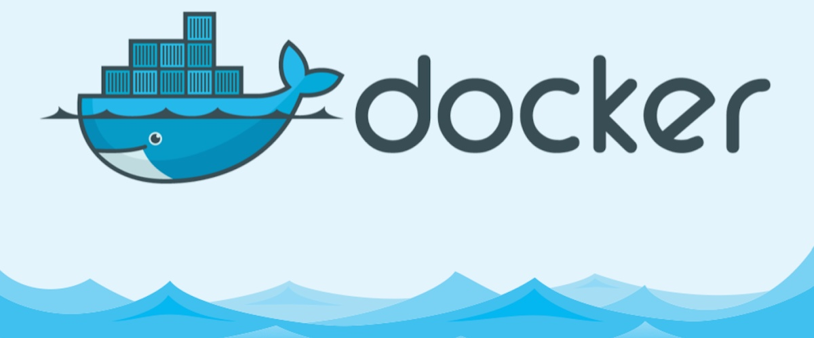
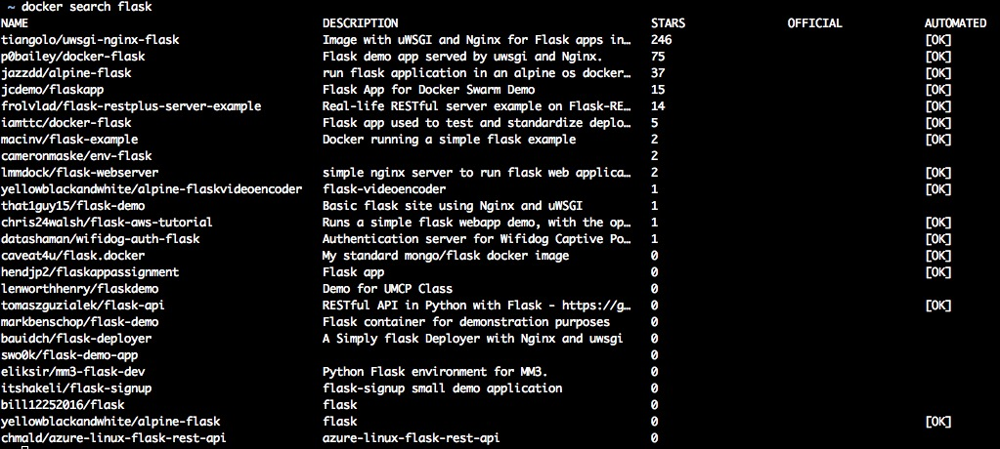
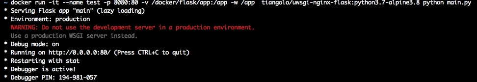
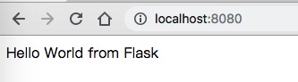
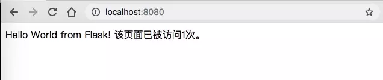

# 被忽略的后端开发神器--docker


刚接触Docker的时候，以为只是用来做运维。后来真正用的时候才发觉，这个Docker简直是个神器。不管什么开发场景都能轻松应付。想要什么环境都能随意生成，而且灵活性更高，更轻量，完美实现`微服务`的概念。
## 什么是`Docker`
`Docker`是一个开源的应用容器引擎，基于`Go`语言 并遵从Apache2.0协议开源。传统虚拟机技术是虚拟出一套硬件后，在其上运行一个完整操作系统，在该系统上再运行所需应用进程；而容器内的应用进程直接运行于宿主的内核，容器内没有自己的内核，而且也没有进行硬件虚拟。它占用的资源更少，能做到的事更多。
### 与传统虚拟机的对比
特性|容器|虚拟机
--:|--:|--:
启动|秒级|分钟级|
硬盘启动|一般为MB|一般为GB
性能|接近原生|弱于
系统支持量|单机支持上千个容器|一般几十个
## 安装`Docker`
安装的方法都挺简单的，我用的是mac，直接通过[Docker官网](https://hub.docker.com/)下载软件安装，全程无障碍。
## `Docker`概念
- 镜像（`images`）：Docker镜像是一个特殊的文件系统，除了提供容器运行时所需的程序、库、资源、配置等文件外，还包含了一些为运行时准备的一些配置参数（如匿名卷、环境变量、用户等）。镜像不包含任何动态数据，其内容在构建之后也不会被改变。(**直白点可以理解为系统安装包**)
- 容器（`container`）：镜像和容器的关系，就像是面向对象程序设计中的`类`和`实例`一样，镜像是静态的定义，容器是镜像运行时的实体。容器可以被创建、启动、停止、删除、暂停等。（**可以理解为安装好的系统**）
## Docker镜像使用
### 一、下载镜像
大概了解了Docker的概念以后，我们就尝试拉取flask镜像使用一下。
查找镜像可以通过[https://hub.docker.com/](https://hub.docker.com/)网站来搜索，或者通过命令搜索。
```bash
docker search flask
```


在这里，我是通过Docker hub官网挑选出了python3.7 + alpine3.8组合的运行环境，`alpine`是精简版的linux，体积更小、运行的资源消耗更少。
```bash
# 拉取镜像
docker pull tiangolo/uwsgi-nginx-flask:python3.7-alpine3.8
# 下载好可查看镜像列表是否存在
docker images
```
### 二、运行flask镜像
下载镜像以后，就开始运行下试试，感受一下Docker的轻量、快捷。
首先创建个flask运行文件来，在这里，我创建了`/docker/flask`作为项目文件，然后在根目录下再创建个`app`文件夹来存放`main.py`文件，代码如下：
```python
from flask import Flask

app = Flask(__name__)

@app.route("/")
def hello():
    return "Hello World from Flask!"

if __name__ == "__main__":
    # 测试环境下才开启debug模式
    app.run(host='0.0.0.0', debug=True, port=80)
```
现在的文件结构：
```
flask
  └── app
      └── main.py
```
运行命令
```bash
docker run -it --name test -p 8080:80 -v /docker/flask/app:/app -w /app tiangolo/uwsgi-nginx-flask:python3.7-alpine3.8 python main.py
```
这里说明一下命令的参数含义：
`-it` 是将-i -t合并起来，作用是可以用指定终端对容器执行命令交互。
`--name` 对容器进行命名。
`-p` 将主机的8080端口映射到容器的80端口。
`-v` 将主机的/docker/flask/app文件挂载到容器的/app文件，如果容器内没有的话会自动创建。
`-w` 将/app文件作为工作区，后面的执行命令都默认在该文件路径下执行。
`tiangolo/uwsgi-nginx-flask:python3.7-alpine3.8` 镜像名跟标签。
`python main.py` 通过python来运行工作区的main.py文件。
运行结果：




现在主机跟容器的链接已经建立起来了，主机通过8080端口就能访问到容器的网站。


## 自定义镜像
在使用别人定制的镜像时总是不能尽善尽美的，如果在自己项目里面，不能每次都是拉取下来重新配置一下。像上面的镜像，我可不喜欢这么长的名字，想想每次要敲这么长的名字都头疼(tiangolo/uwsgi-nginx-flask:python3.7-alpine3.8)。


### 编写Dockerfile文件
打开我们刚才的/docker/flask路径，在根目录下创建Dockerfile文件，内容如下。
```docker
# 基础镜像
FROM tiangolo/uwsgi-nginx-flask:python3.7-alpine3.8

# 没有vim来查看文件很不习惯，利用alpine的包管理安装一个来
RUN apk add vim

# 顺便用pip安装个redis包，后面用得上
RUN pip3 install redis

# 将我们的app文件加入到自定义镜像里面去
COPY ./app /app
```
现在我们的文件结构是：
```
flask
├── app
│   └── main.py
└── Dockerfile
```
剩下的就跑一遍就OK啦！**记得一定要在`Dockerfile`文件同级目录下执行build命令。**
```bash
docker build -t myflask .

Sending build context to Docker daemon  4.608kB
Step 1/4 : FROM tiangolo/uwsgi-nginx-flask:python3.7-alpine3.8
 ---> c69984ff0683
Step 2/4 : RUN apk add vim
 ---> Using cache
 ---> ebe2947fcf89
Step 3/4 : RUN pip3 install redis
 ---> Running in aa774ba9030e
Collecting redis
  Downloading https://files.pythonhosted.org/packages/f5/00/5253aff5e747faf10d8ceb35fb5569b848cde2fdc13685d42fcf63118bbc/redis-3.0.1-py2.py3-none-any.whl (61kB)
Installing collected packages: redis
Successfully installed redis-3.0.1
Removing intermediate container aa774ba9030e
 ---> 47a0f1ce8ea2
Step 4/4 : COPY ./app /app
 ---> 50908f081641
Successfully built 50908f081641
Successfully tagged myflask:latest
```
`-t` 指定要创建的目标路径。
`.` **这里有个点记住啦**，表示是当前路径下的Dockerfile文件，可以指定为绝对路径。
编译完后就通过`docker images`查看一下，就能看到myflask镜像了，里面能直接运行`python main.py`来启动flask，并且内置了vim和redis包。


## `Docker Compose`让多容器成为一个整体
我们的每个容器都负责一个服务，这样容器多的时候一个个手动启动的话是不现实的。在这种情况我们可以通过`Docker Compose`来关联每个容器，组成一个完整的项目。
>`Compose`项目由`Python`编写，实现上调用了 `Docker`服务提供的 API 来对容器进行管理。
```bash
# 安装docker-compose
sudo pip3 install docker-compose
```

### 实现能记录访问次数的web
在这里，我们通过`docker-compose.yml`文件来启动`flask`容器和`redis`容器，并将两个不同容器相互关联起来。
首先在/docker/flask目录下创建`docker-compose.yml`文件，内容如下：
```docker
version: '3'
services:
  flask:
      image: myflask
      container_name: myflask
      ports:
        - 8080:80
      volumes:
        - /docker/flask/app:/app
      working_dir: /app
      # 运行后执行的命令
      command: python main.py
      
  redis:
    # 如果没有这个镜像的话会自动下载
    image: "redis:latest"
    container_name: myredis
```
然后我们把上面的`main.py`代码修改一下，连接redis数据库并记录网站访问次数。`main.py`修改后内容如下:
```python
from flask import Flask
from redis import Redis

app = Flask(__name__)
redis = Redis(host='redis', port=6379)


@app.route("/")
def hello():
    count = redis.incr('visit')
    return f"Hello World from Flask! 该页面已被访问{count}次。"


if __name__ == "__main__":
    # Only for debugging while developing
    app.run(host='0.0.0.0', debug=True, port=80)
```
目前的文件结构是：
```
flask
├── app
│   └── main.py
└── Dockerfile
└── docker-compose.yml
```
这些编排的文件参数都是取自于`Docker`，基本都能看懂，其它就没啥啦，直接命令行跑起来：
```bash
docker-compose up
```
就辣么简单!现在我们在浏览器上访问`http://localhost:8080/`就能看到结果了，并且每访问一次这页面都会自动增加访问次数.


在这里，我们也能通过`docker ps`命令查看运行中的容器：
```bash
docker ps

CONTAINER ID        IMAGE               COMMAND                  CREATED             STATUS              PORTS                           NAMES
66133318452d        redis:latest        "docker-entrypoint.s…"   13 seconds ago      Up 12 seconds       6379/tcp                        myredis
0956529c3c9c        myflask             "/entrypoint.sh pyth…"   13 seconds ago      Up 11 seconds       443/tcp, 0.0.0.0:8080->80/tcp   myflask
```
有了`Docker Compose`的`Docker`才是完整的`Docker`，有了这些以后开发简直不要太爽，每个容器只要维护自己的服务环境就ok了。


## Docker的日常操作
### 镜像常用操作
```bash
# 下载镜像
docker pull name
# 列出本地镜像
docker images
# 使用镜像运行生成容器
docker run name:tag
# 删除镜像
docker rmi id/name
```
### 容器常用操作
可以通过容器的id或者容器别名来启动、停止、重启。
```bash
# 查看运行中的容器
docker ps
# 查看所有生成的容器
docker ps -a
# 开始容器
docker start container
# 停止容器
docker stop container
# 重启容器
docker restart container
# 移除不需要的容器(移除前容器必须要处于停止状态)
docker rm container
# 进入后台运行的容器
docker exec -it container /bin/sh
# 打印容器内部的信息（-f参数能实时观察内部信息）
docker logs -f container
```
通过`-i -t`进来容器的，可以先按`ctrl + p`, 然后按`ctrl + q`来退出交互界面组，这样退出不会关闭容器。
### docker-compose常用操作
```bash
# 自动完成包括构建镜像,（重新）创建服务，启动服务，并关联服务相关容器的一系列操作。
docker-compose up
# 此命令将会停止 up 命令所启动的容器，并移除网络
docker-compose down
# 启动已经存在的服务容器。
docker-compose start
# 停止已经处于运行状态的容器，但不删除它。通过start可以再次启动这些容器。
docker-compose stop
# 重启项目中的服务
docker-compose restart
```
默认情况，`docker-compose up`启动的容器都在前台，控制台将会同时打印所有容器的输出信息，可以很方便进行调试。当通过`Ctrl-C`停止命令时，所有容器将会停止。

## 结语
这次接触`Docker`的时间虽然不长，但是这种微服务细分的架构真的是惊艳到我了。以前玩过VM虚拟机，那个使用成本太高，不够灵活，用过一段时间就放弃了，老老实实维护自己的本机环境。有了这个`Docker`以后，想要什么测试环境都行，直接几行代码生成就好，一种随心所欲的自由。
上面写的那些都是日常使用的命令，能应付基本的需求了，真要深入的话建议去找详细的文档，我就不写太累赘了，希望大家都能去接触一下这个`Docker`，怎么都不亏，你们也会喜欢上这小鲸鱼的。

