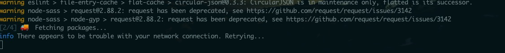

## 安装步骤卡Fetching packages时
到这一步遇到一直卡在最后一步无法进行，一直显示网络不好

解决方法：
通过npm安装yrm来切换安装源
```
npm install -g yrm
yrm use taobao
```

## 安装步骤出现编译fresh package卡住的情况
对相关模块进行`yarn`国内加速，运行以下所有配置：
```
yarn config set registry "https://registry.npm.taobao.org"
yarn config set sass_binary_site "https://npm.taobao.org/mirrors/node-sass/"
yarn config set phantomjs_cdnurl "http://cnpmjs.org/downloads"
yarn config set electron_mirror "https://npm.taobao.org/mirrors/electron/"
yarn config set sqlite3_binary_host_mirror "https://foxgis.oss-cn-shanghai.aliyuncs.com/"
yarn config set profiler_binary_host_mirror "https://npm.taobao.org/mirrors/node-inspector/"
yarn config set chromedriver_cdnurl "https://cdn.npm.taobao.org/dist/chromedriver"
```

运行完以上步骤后，就没到啥问题了，安装electron-vue模块完成。