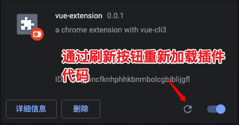
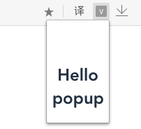
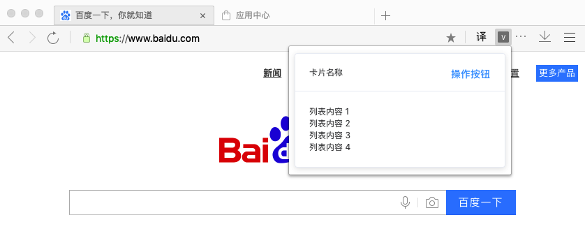
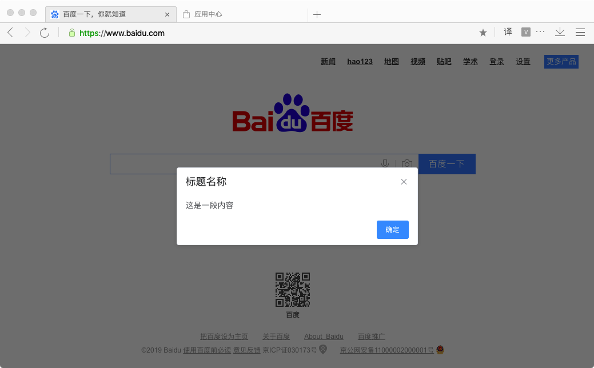
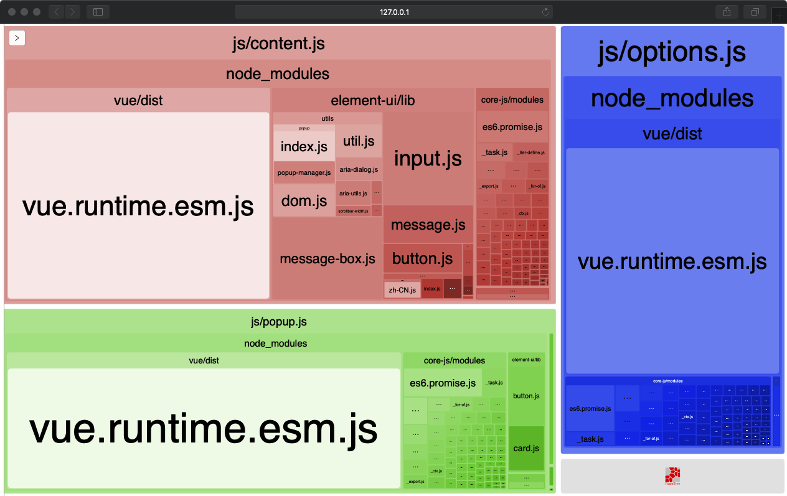

---
tags:
- 前端
- 插件
---
# vue-cli3开发Chrome Extension实践

之前找了不少如何开发谷歌插件的文章，结果发现都是很基础的内容，并没有写到如何快捷编译打包插件。我就在想为什么不能通过webpack来打包插件呢？如果通过webpack编译的话，就能使开发过程变得更舒服，使文件结构趋向模块化，并且打包的时候直接编译压缩代码。后来发现`vue-cli-plugin-chrome-ext`插件，通过这个插件能很容易将`vue-cli3`拿来开发谷歌插件，并能很舒服地引用各种UI框架跟npm插件。

## 搭建环境

    1.创建一个`vue-cli3`项目： `vue create vue-extension`，对话流程选择默认就行。
    2. 进入项目`cd vue-extension`
    3.安装`vue-cli-plugin-chrome-ext`插件：`vue add chrome-ext`,根据安装对话选项设置好。
    4.删除`vue-cli3`无用文件跟文件夹：`src/main.js`，`public`、`src/components`

## 运行项目

* `npm run build-watch` 运行开发环境，对修改文件进行实时编译。自动在根目录下生成`dist`文件夹，然后在浏览器上加载`dist`文件夹完成插件安装。(注意：修改`background`文件跟`manifest.json`文件并不能实时刷新代码，需要重新加载插件才行)


* `npm run build` 运行生产环境编译打包，将所有文件进行整合打包。

## 引入element UI
目前的插件加载到浏览器后是这种界面：

平时我们肯定要引入好看的UI框架的，在这里我们可以引入`element-ui`，首先安装：
```
npm install element-ui
```
考虑到插件打包后的文件大小，最后通过按需加载的方式来引入组件，按照官方的方法，要先安装`babel-plugin-component`插件:
```
npm install babel-plugin-component -D
```
然后，将`babel.config.js`修改为：
```js
module.exports = {
  presets: [
    '@vue/app'
  ],
  "plugins": [
    [
      "component",
      {
        "libraryName": "element-ui",
        "styleLibraryName": "theme-chalk"
      }
    ]
  ]
}
```
接下来修改popup相关文件，来引入所需组件，
`src/popup/index.js`内容:
```js
import Vue from "vue";
import AppComponent from "./App/App.vue";

Vue.component("app-component", AppComponent);

import {
  Card
} from 'element-ui';

Vue.use(Card);

new Vue({
  el: "#app",
  render: createElement => {
    return createElement(AppComponent);
  }
});
```
`src/popup/App/App.vue` 内容：
```html
<template>
  <el-card class="box-card">
    <div
      slot="header"
      class="clearfix"
    >
      <span>卡片名称</span>
      <el-button
        style="float: right; padding: 3px 0"
        type="text"
      >操作按钮</el-button>
    </div>
    <div
      v-for="o in 4"
      :key="o"
      class="text item"
    >
      {{'列表内容 ' + o }}
    </div>
  </el-card>
</template>

<script>
export default {
  name: 'app',
}
</script>

<style>
.box-card {
  width: 300px;
}
</style>
```
渲染效果：


当然，不仅仅是插件内部的页面，还可以将`element-ui`组件插入到`content`页面。

## `content.js`使用`element-ui`组件
`content.js`主要作用于浏览网页，对打开的网页进行插入、修改`DOM`，对其进行操作交互。别觉得`element-ui`只能配合`vue`使用，其实就是一个前端框架，只要我们引入了就能使用，`webpack`自动会帮我们抽离出来编译打包。

首先我们创建`src/content/index`文件，内容：
```js
import {
    Message,
    MessageBox
} from 'element-ui';

// 发现element的字体文件无法通过打包加载，所以另外通过cdn来加载样式
let element_css = document.createElement('link');
element_css.href = 'https://unpkg.com/element-ui@2.8.2/lib/theme-chalk/index.css'
element_css.rel = "stylesheet"
document.head.append(element_css)

MessageBox.alert('这是一段内容', '标题名称', {
    confirmButtonText: '确定',
    callback: action => {
        Message({
            type: 'info',
            message: `action: ${ action }`
        });
    }
})
```
`vue.config.js`增加`content.js`文件的打包配置，因为`content.js`（`background.js`同样可以只生成js文件）只有js文件，不用像app模式那样打包生成相应的`html`文件，完整内容如下：
```js
const CopyWebpackPlugin = require("copy-webpack-plugin");
const path = require("path");

// Generate pages object
const pagesObj = {};

const chromeName = ["popup", "options"];

chromeName.forEach(name => {
  pagesObj[name] = {
    entry: `src/${name}/index.js`,
    template: "public/index.html",
    filename: `${name}.html`
  };
});

const plugins =
  process.env.NODE_ENV === "production" ? [{
    from: path.resolve("src/manifest.production.json"),
    to: `${path.resolve("dist")}/manifest.json`
  }] : [{
    from: path.resolve("src/manifest.development.json"),
    to: `${path.resolve("dist")}/manifest.json`
  }];

module.exports = {
  pages: pagesObj,
  // // 生产环境是否生成 sourceMap 文件
  productionSourceMap: false,

  configureWebpack: {
    entry: {
      'content': './src/content/index.js'
    },
    output: {
      filename: 'js/[name].js'
    },
    plugins: [CopyWebpackPlugin(plugins)]
  },
  css: {
    extract: {
      filename: 'css/[name].css'
      // chunkFilename: 'css/[name].css'
    }
  }
};
```
最后在`manifest.development.json`加载`content.js`文件：
```json
{
    "manifest_version": 2,
    "name": "vue-extension",
    "description": "a chrome extension with vue-cli3",
    "version": "0.0.1",
    "options_page": "options.html",
    "browser_action": {
        "default_popup": "popup.html"
    },
    "content_security_policy": "script-src 'self' 'unsafe-eval'; object-src 'self'",
    "content_scripts": [{
        "matches": [
            "*://*.baidu.com/*"
        ],
        "js": [
            "js/content.js"
        ],
        "run_at": "document_end"
    }]
}
```
然后浏览器重新加载插件后打开`https://www.baidu.com/`网址后可看到：



## 添加打包文件大小预览配置
既然用了`vue-cli3`了，怎能不继续折腾呢，我们平时用`webpack`开发肯定离不开打包组件预览功能，才能分析哪些组件占用文件大，该有的功能一个都不能少😎。这么实用的功能，实现起来也无非就是添加几行代码的事：
```js
// vue.config.js

module.export = {
  /* ... */

  chainWebpack: config => {
    // 查看打包组件大小情况
    if (process.env.npm_config_report) {
      // 在运行命令中添加 --report参数运行， 如：npm run build --report
      config
        .plugin('webpack-bundle-analyzer')
        .use(require('webpack-bundle-analyzer').BundleAnalyzerPlugin)
    }
  }
}
```
就辣么简单，然后运行`npm run build --report`看看效果：

搞定收工！


## 结语
事实证明，`vue-cli3`很强大，`vue`相关的插件并不是不能应用于开发浏览器插件，`element-ui`也不仅限于`vue`的运用。只有你想不到，没有做不到的事😁。
