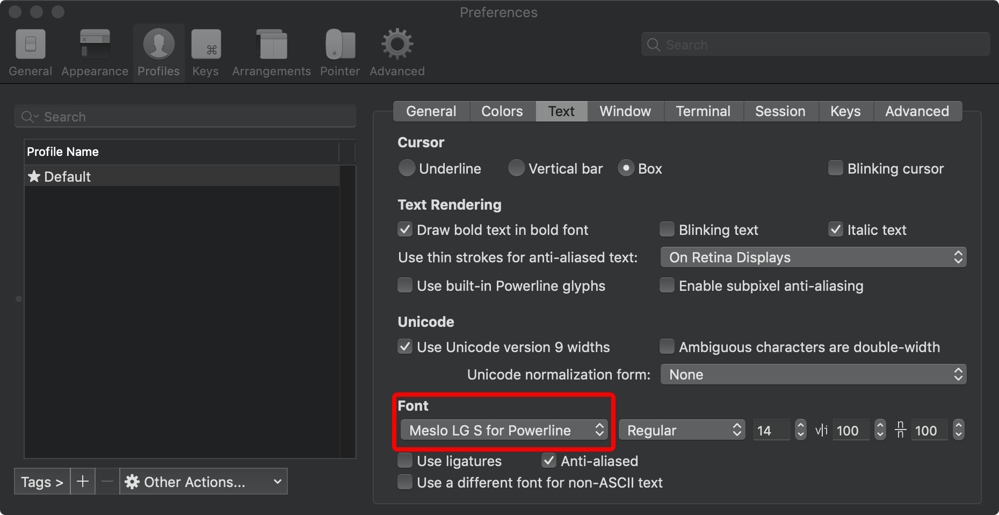

> 文章来源于 [鶸杰](https://github.com/Mercer-Lee)

先安装oh-my-zsh

```
sh -c "$(curl -fsSL https://raw.githubusercontent.com/robbyrussell/oh-my-zsh/master/tools/install.sh)"
```

安装完成后按Y让oh-my-zsh是默认shell

安装oh-my-zsh成功后

终端输入
```
vi ~/.zshrc
```
更改以下
ZSH_THEME="agnoster" 将zsh主题修改为“agnoster”

使用 [Meslo](https://github.com/powerline/fonts/blob/master/Meslo%20Slashed/Meslo%20LG%20M%20Regular%20for%20Powerline.ttf) 字体，点开链接点击 view raw 下载字体

安装字体到系统字体册
在iTerm2中应用字体 



## autojump
这个插件很好用，如果你想摆脱不断cd打开文件目录的话就安装这个插件，能通过`j XX文件名`直接跳转到相应目录，一键抵达。
```
brew install autojump
```

## 自动补全
克隆仓库到本地 ~/.oh-my-zsh/custom/plugins 路径下
```
git clone git://github.com/zsh-users/zsh-autosuggestions $ZSH_CUSTOM/plugins/zsh-autosuggestions
```

## 语法高亮
```
cd ~/.oh-my-zsh/custom/plugins

git clone https://github.com/zsh-users/zsh-syntax-highlighting.git
```
然后修改配置文件
```
vi ~/.zshrc
```
找到plugins这段，然后改为如下：
```
plugins=(git zsh-syntax-highlighting  zsh-autosuggestions Z autojump)

source $ZSH/oh-my-zsh.sh

[[ -s $(brew --prefix)/etc/profile.d/autojump.sh ]] && . $(brew --prefix)/etc/profile.d/autojump.sh
```


