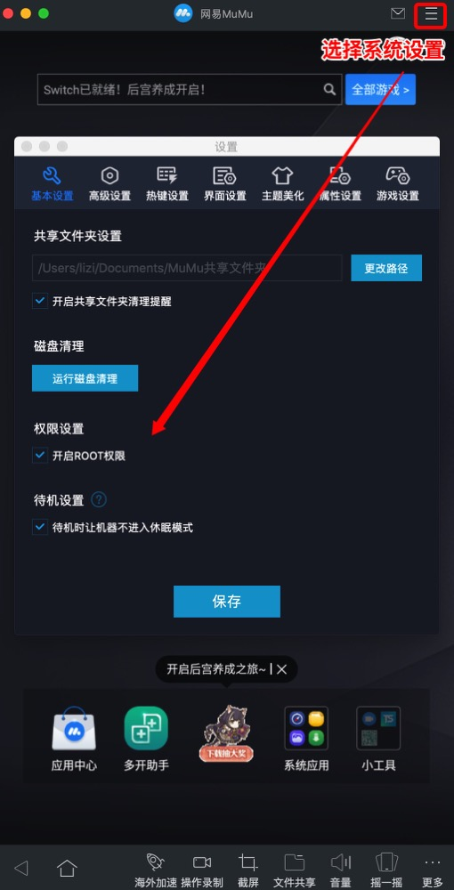
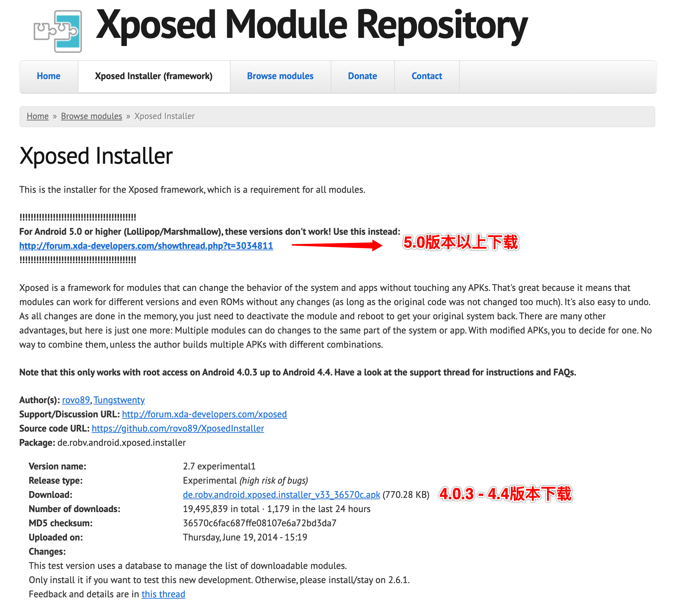
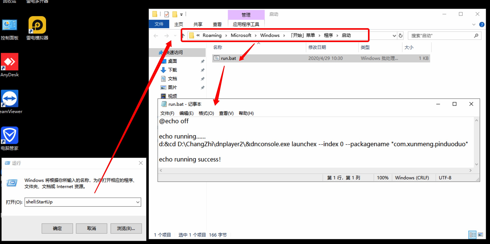

## 1.环境准备

### 1.1安装mumu模拟器

1. 下载[mumu模拟器](https://mumu.163.com/)

2. 安装完成后点击模拟器右上角打开设置后开启root权限。



3. 下载对应版本的[xposed install](https://repo.xposed.info/module/de.robv.android.xposed.installer)(具体版本可以在模拟器的关于手机里面查看)



4. xposed install安装好后进去安装框架并重启。

5. 通过adb连接模拟器：
```
1.adb连接单个模拟器
夜神模拟器，x86架构
# adb connect 127.0.0.1:62001
 
网易MUMU模拟器
# adb connect 127.0.0.1:7555
 
逍遥安卓模拟器
# adb connect 127.0.0.1:21503
 
天天模拟器
# adb connect 127.0.0.1:6555
 
海马玩模拟器 
# adb connect 127.0.0.1:53001
 
蓝叠模拟器,支持arm架构
# adb connect 127.0.0.1:5555
 
2.断开模拟器
# adb disconnect 127.0.0.1:62001
```

## 打包
### 区分开发环境跟生产环境
根据生产环境跟开发环境进行判断区分变量，从而执行不同的代码
1. 修改项目根目录下的`build.gradle`文件内容，增加开发环境跟生产环境变量：
```
buildTypes {
  release {
    minifyEnabled false
    proguardFiles getDefaultProguardFile('proguard-android-optimize.txt'), 'proguard-rules.pro'
  
    buildConfigField "Boolean", "ENVIRONMENT", "true"   // 生产环境为true
  }
  debug {
    buildConfigField "Boolean", "ENVIRONMENT", "false"  // 生产环境为false
  }
}
```
2. 项目内全局搜索`BuildConfig`类，类里面增加环境变量:
```
public static final boolean ENVIRONMENT = true;
```
3. 项目内可根据`BuildConfig.ENVIRONMENT`变量来判断是否开发环境
```
private Integer threadNum = BuildConfig.ENVIRONMENT ? 20 : 10;      // 根据环境生成不同的进程数
```

## 部署
### windows开机自动启动
编写bat脚本内容：
```
// 1、打开d盘 2、打开雷电模拟器安装路径 3、在雷电安装文件夹下执行启动命令
d:&cd D:\ChangZhi\dnplayer2\&dnconsole.exe launchex --index 0 --packagename "com.xunmeng.pinduoduo"
```
bat脚本放入windows启动文件夹，这样的话在windows启动后会自动执行命令。
